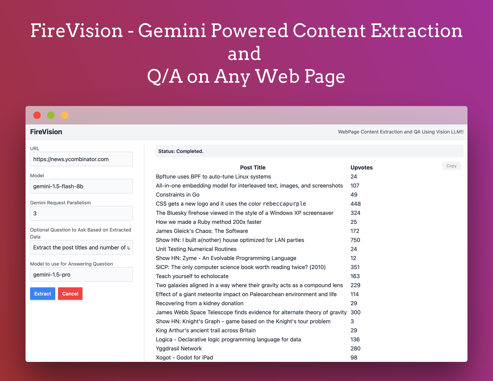
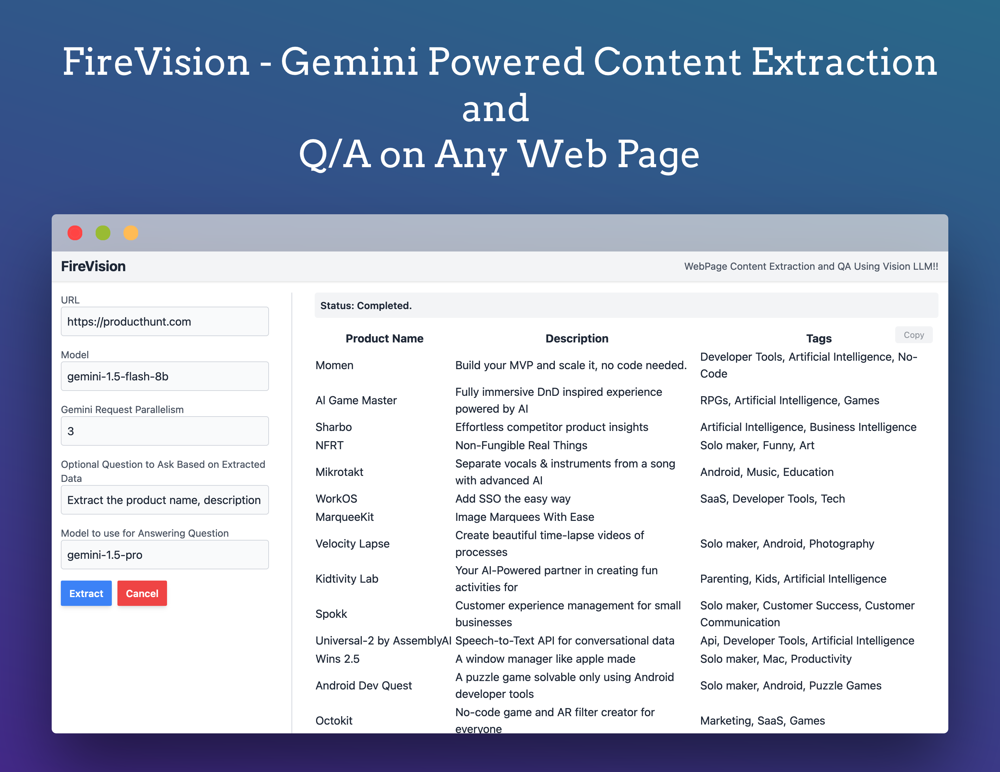
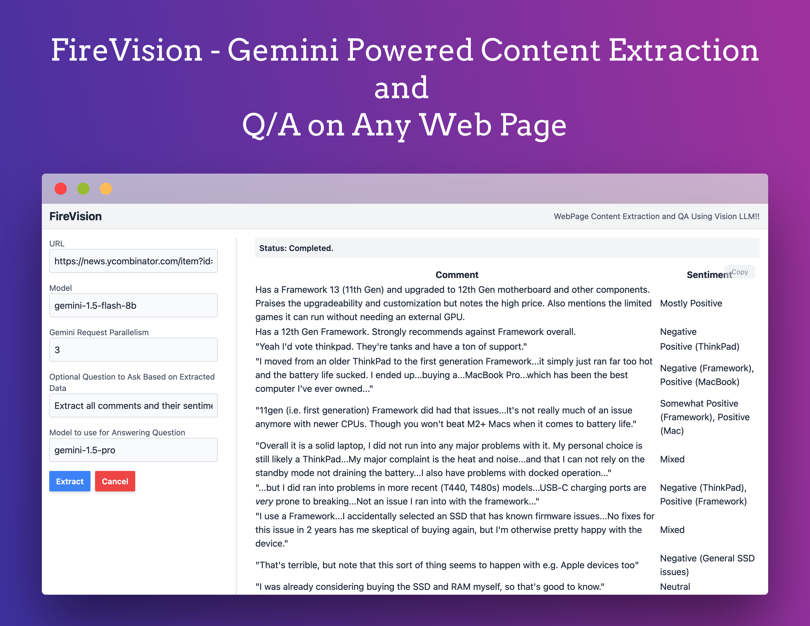

# 🔥 FireVision - Web Page Content Extraction & QA Using Vision LLM! 🕶️✨

📸 **Screenshots**  
  
  

🎥 **Demo Video**  
<video src="./readme_media/video1.mp4" controls="controls" width="600">
Your browser does not support the video tag. Please download the video to view it.
</video>

---

## 🚀 How to Use  
1️⃣ **Install dependencies:** `npm install` (or `pnpm` / `yarn` equivalents)  
2️⃣ **Start the server:** `node server.js` – No build steps needed!  
3️⃣ **Visit the app:** Open [http://localhost:8000](http://localhost:8000) in your browser 🌐  

⚠️ **Note:** This app uses OCR, so it may run slower, but it achieves **better results** than plain HTML-to-Markdown conversion 🖋️👌

---

## 🛠️ How It Works  
1. 🧭 **Navigates:** Launches Puppeteer and visits the entered URL  
2. 🖼️ **Splits Pages:** Breaks the webpage into chunks of `1200px` height  
3. 📷 **Captures Screenshots:** Saves each chunk temporarily to a local directory  
4. 🔍 **Performs OCR:** Uses the **Gemini Vision API** to extract text from screenshots with parallel processing 🔄  
5. 📜 **Combines Text:** Gathers and merges Markdown from each screenshot 📝  
6. ❓ **Answers Questions:** Optionally answers questions based on the extracted text using an advanced chat model 🤖  
7. ✅ **Returns Results:** Delivers either the full OCR text or the QA-enhanced response 🚀  

---

Feel free to tweak it further for your specific audience! 🚀